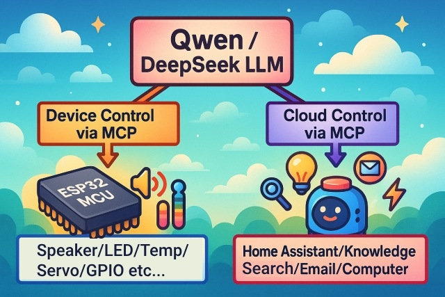

> **修改笔记：**
> - 增加可自定义热点名称的选项 `CONFIG_CUSTOM_SSID_PREFIX="AI-VOX"`
> - 增加 NULLLAB AI-Vox v3 开发板
> - 增加 NULLLAB AI-Vox 开发版的的两个开发案例：
>     - 自定义图片表情（[nulllab-ai-vox-emoji](./main/boards/nulllab-ai-vox-emoji)）
>     - 动画眼睛表情（[nulllab-ai-vox-eyes](./main/boards/nulllab-ai-vox-eyes)）
>     - Otto 机器人
> - NULLLAB AI-Vox v3 支持实时打断（完全），可以随时打断小智说话，默认开启 `CONFIG_USE_DEVICE_AEC=y`
> - NULLLAB AI-Vox 不再支持实时打断（因为效果不好）
> - 编译配置通过 idf.py menuconfig 进行设置或在开发板的 config.json 中设置（推荐）
> - 图片转换工具 [https://lvgl.io/tools/imageconverter](https://lvgl.io/tools/imageconverter)
>
> 推荐使用编译脚本进行编译：`python3 ./scripts/release.py [开发板名称]`，省去切换开发板配置。
> 案例所需要的配置都写在了 config.json 文件中，编译脚本可以自动完成配置。

# An MCP-based Chatbot | 一个基于 MCP 的聊天机器人

（中文 | [English](README_en.md) | [日本語](README_ja.md)）

## 视频

👉 [人类：给 AI 装摄像头 vs AI：当场发现主人三天没洗头【bilibili】](https://www.bilibili.com/video/BV1bpjgzKEhd/)

👉 [手工打造你的 AI 女友，新手入门教程【bilibili】](https://www.bilibili.com/video/BV1XnmFYLEJN/)

## 介绍

这是一个由虾哥开源的 ESP32 项目，以 MIT 许可证发布，允许任何人免费使用，或用于商业用途。

我们希望通过这个项目，能够帮助大家了解 AI 硬件开发，将当下飞速发展的大语言模型应用到实际的硬件设备中。

如果你有任何想法或建议，请随时提出 Issues 或加入 QQ 群：1011329060

### 基于 MCP 控制万物

小智 AI 聊天机器人作为一个语音交互入口，利用 Qwen / DeepSeek 等大模型的 AI 能力，通过 MCP 协议实现多端控制。

### 已实现功能

- Wi-Fi / ML307 Cat.1 4G
- 离线语音唤醒 [ESP-SR](https://github.com/espressif/esp-sr)
- 支持两种通信协议（[Websocket](docs/websocket.md) 或 MQTT+UDP）
- 采用 OPUS 音频编解码
- 基于流式 ASR + LLM + TTS 架构的语音交互
- 声纹识别，识别当前说话人的身份 [3D Speaker](https://github.com/modelscope/3D-Speaker)
- OLED / LCD 显示屏，支持表情显示
- 电量显示与电源管理
- 支持多语言（中文、英文、日文）
- 支持 ESP32-C3、ESP32-S3、ESP32-P4 芯片平台
- 通过设备端 MCP 实现设备控制（音量、灯光、电机、GPIO 等）
- 通过云端 MCP 扩展大模型能力（智能家居控制、PC桌面操作、知识搜索、邮件收发等）

## 硬件

### 面包板手工制作实践

详见飞书文档教程：

👉 [《小智 AI 聊天机器人百科全书》](https://ccnphfhqs21z.feishu.cn/wiki/F5krwD16viZoF0kKkvDcrZNYnhb?from=from_copylink)

面包板效果图如下：

### 支持 70 多个开源硬件（仅展示部分）

- <a href="https://oshwhub.com/li-chuang-kai-fa-ban/li-chuang-shi-zhan-pai-esp32-s3-kai-fa-ban" target="_blank" title="立创·实战派 ESP32-S3 开发板">立创·实战派 ESP32-S3 开发板</a>
- <a href="https://github.com/espressif/esp-box" target="_blank" title="乐鑫 ESP32-S3-BOX3">乐鑫 ESP32-S3-BOX3</a>
- <a href="https://docs.m5stack.com/zh_CN/core/CoreS3" target="_blank" title="M5Stack CoreS3">M5Stack CoreS3</a>
- <a href="https://docs.m5stack.com/en/atom/Atomic%20Echo%20Base" target="_blank" title="AtomS3R + Echo Base">M5Stack AtomS3R + Echo Base</a>
- <a href="https://gf.bilibili.com/item/detail/1108782064" target="_blank" title="神奇按钮 2.4">神奇按钮 2.4</a>
- <a href="https://www.waveshare.net/shop/ESP32-S3-Touch-AMOLED-1.8.htm" target="_blank" title="微雪电子 ESP32-S3-Touch-AMOLED-1.8">微雪电子 ESP32-S3-Touch-AMOLED-1.8</a>
- <a href="https://github.com/Xinyuan-LilyGO/T-Circle-S3" target="_blank" title="LILYGO T-Circle-S3">LILYGO T-Circle-S3</a>
- <a href="https://oshwhub.com/tenclass01/xmini_c3" target="_blank" title="虾哥 Mini C3">虾哥 Mini C3</a>
- <a href="https://oshwhub.com/movecall/cuican-ai-pendant-lights-up-y" target="_blank" title="Movecall CuiCan ESP32S3">璀璨·AI 吊坠</a>
- <a href="https://github.com/WMnologo/xingzhi-ai" target="_blank" title="无名科技Nologo-星智-1.54">无名科技 Nologo-星智-1.54TFT</a>
- <a href="https://www.seeedstudio.com/SenseCAP-Watcher-W1-A-p-5979.html" target="_blank" title="SenseCAP Watcher">SenseCAP Watcher</a>
- <a href="https://www.bilibili.com/video/BV1BHJtz6E2S/" target="_blank" title="ESP-HI 超低成本机器狗">ESP-HI 超低成本机器狗</a>

  
  
  
  
  
  
  
  
  
  
  
  

## 软件

### 固件烧录

新手第一次操作建议先不要搭建开发环境，直接使用免开发环境烧录的固件。

固件默认接入 [xiaozhi.me](https://xiaozhi.me) 官方服务器，个人用户注册账号可以免费使用 Qwen 实时模型。

👉 [新手烧录固件教程](https://ccnphfhqs21z.feishu.cn/wiki/Zpz4wXBtdimBrLk25WdcXzxcnNS)

### 开发环境

- Cursor 或 VSCode
- 安装 ESP-IDF 插件，选择 SDK 版本 5.4 或以上
- Linux 比 Windows 更好，编译速度快，也免去驱动问题的困扰
- 本项目使用 Google C++ 代码风格，提交代码时请确保符合规范

### 开发者文档

- [自定义开发板指南](main/boards/README.md) - 学习如何为小智 AI 创建自定义开发板
- [MCP 协议物联网控制用法说明](docs/mcp-usage.md) - 了解如何通过 MCP 协议控制物联网设备
- [MCP 协议交互流程](docs/mcp-protocol.md) - 设备端 MCP 协议的实现方式
- [MQTT + UDP 混合通信协议文档](docs/mqtt-udp.md)
- [一份详细的 WebSocket 通信协议文档](docs/websocket.md)

## 大模型配置

如果你已经拥有一个小智 AI 聊天机器人设备，并且已接入官方服务器，可以登录 [xiaozhi.me](https://xiaozhi.me) 控制台进行配置。

👉 [后台操作视频教程（旧版界面）](https://www.bilibili.com/video/BV1jUCUY2EKM/)

## 相关开源项目

在个人电脑上部署服务器，可以参考以下第三方开源的项目：

- [xinnan-tech/xiaozhi-esp32-server](https://github.com/xinnan-tech/xiaozhi-esp32-server) Python 服务器
- [joey-zhou/xiaozhi-esp32-server-java](https://github.com/joey-zhou/xiaozhi-esp32-server-java) Java 服务器
- [AnimeAIChat/xiaozhi-server-go](https://github.com/AnimeAIChat/xiaozhi-server-go) Golang 服务器

使用小智通信协议的第三方客户端项目：

- [huangjunsen0406/py-xiaozhi](https://github.com/huangjunsen0406/py-xiaozhi) Python 客户端
- [TOM88812/xiaozhi-android-client](https://github.com/TOM88812/xiaozhi-android-client) Android 客户端
- [100askTeam/xiaozhi-linux](http://github.com/100askTeam/xiaozhi-linux) 百问科技提供的 Linux 客户端
- [78/xiaozhi-sf32](https://github.com/78/xiaozhi-sf32) 思澈科技的蓝牙芯片固件
- [QuecPython/solution-xiaozhiAI](https://github.com/QuecPython/solution-xiaozhiAI) 移远提供的 QuecPython 固件

## Star History

<a href="https://star-history.com/#78/xiaozhi-esp32&Date">
 <picture>
   <source media="(prefers-color-scheme: dark)" srcset="https://api.star-history.com/svg?repos=78/xiaozhi-esp32&type=Date&theme=dark" />
   <source media="(prefers-color-scheme: light)" srcset="https://api.star-history.com/svg?repos=78/xiaozhi-esp32&type=Date" />
   
 </picture>
</a>
